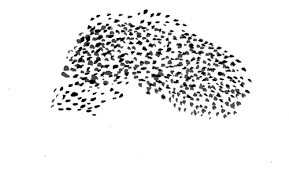

<!-- BEGIN_TF_DOCS -->
# cloud\_murmation
### Terraform module for creating free cloud infrastructure in Oracle Cloud and Google Cloud using Terraform Cloud for state management.

===

## Providers

| Name | Version |
|------|---------|
|  [google](#provider\_google) | >= 4.70.0 |
|  [oci](#provider\_oci) | >= 5.2.0 |

## Resources

| Name | Type |
|------|------|
| [google_compute_instance.gcp_instance](https://registry.terraform.io/providers/hashicorp/google/latest/docs/resources/compute_instance) | resource |
| [oci_core_instance.oci_instance1](https://registry.terraform.io/providers/oracle/oci/latest/docs/resources/core_instance) | resource |
| [oci_core_instance.oci_instance2](https://registry.terraform.io/providers/oracle/oci/latest/docs/resources/core_instance) | resource |
| [oci_core_instance.oci_instance3](https://registry.terraform.io/providers/oracle/oci/latest/docs/resources/core_instance) | resource |
| [google_compute_network.network](https://registry.terraform.io/providers/hashicorp/google/latest/docs/data-sources/compute_network) | data source |

## Inputs

| Name | Description | Type | Default | Required |
|------|-------------|------|---------|:--------:|
|  [b64\_gcp\_credentials](#input\_b64\_gcp\_credentials) | *"b64\_gcp\_credentials(preferred)" or "gcp\_credentials"* - the credentials for the GCP Terraform provider. Instructions for getting them are here: https://support.hashicorp.com/hc/en-us/articles/4406586874387-How-to-set-up-Google-Cloud-GCP-credentials-in-Terraform-Cloud | `string` | `null` | no |
|  [gcp\_credentials](#input\_gcp\_credentials) | *"b64\_gcp\_credentials(preferred)" or "gcp\_credentials"* - the credentials for the GCP Terraform provider. Instructions for getting them are here: https://support.hashicorp.com/hc/en-us/articles/4406586874387-How-to-set-up-Google-Cloud-GCP-credentials-in-Terraform-Cloud | `string` | `null` | no |
|  [gcp\_displayname](#input\_gcp\_displayname) | the displayname that be seen in the GCP UI | `string` | `"instance"` | no |
|  [gcp\_hostname](#input\_gcp\_hostname) | the hostname to give the instance | `string` | `"instance"` | no |
|  [gcp\_image](#input\_gcp\_image) | image to use for the instance. 'Premium' images are not free. Here are some of the images available: https://cloud.google.com/compute/docs/images/os-details | `string` | `"ubuntu-2204-lts"` | no |
|  [gcp\_map\_of\_ssh\_usernames\_and\_public\_keys](#input\_gcp\_map\_of\_ssh\_usernames\_and\_public\_keys) | map of ssh usernames and public keys. at a minimum you will need a key for the ubuntu user, ex: { ubuntu = 'mypublickeyeample'} | `map` | n/a | yes |
|  [gcp\_network](#input\_gcp\_network) | network name to put the instance in. | `string` | `"default"` | no |
|  [gcp\_project](#input\_gcp\_project) | the human-readable name for the project to put the instance in *not the id* | `string` | n/a | yes |
|  [oci\_api\_private\_key](#input\_oci\_api\_private\_key) | private key for the OCID user. https://docs.oracle.com/en-us/iaas/Content/API/Concepts/apisigningkey.htm | `string` | n/a | yes |
|  [oci\_displayname1](#input\_oci\_displayname1) | the displayname that be seen for non-ARM instance1 in the OCI UI | `string` | `"instance1"` | no |
|  [oci\_displayname2](#input\_oci\_displayname2) | the displayname that be seen for the non-ARM instance2 in the OCI UI | `string` | `"instance2"` | no |
|  [oci\_displayname3](#input\_oci\_displayname3) | the displayname that be seen for the ARM instance in the OCI UI | `string` | `"instance3"` | no |
|  [oci\_fingerprint](#input\_oci\_fingerprint) | the fingerprint of the key for the OCID user. https://docs.oracle.com/en-us/iaas/Content/API/Concepts/apisigningkey.htm | `string` | n/a | yes |
|  [oci\_hostname1](#input\_oci\_hostname1) | the hostname to give the non-ARM instance1 | `string` | `"instance1"` | no |
|  [oci\_hostname2](#input\_oci\_hostname2) | the hostname to give the non-ARM instance2 | `string` | `"instance2"` | no |
|  [oci\_hostname3](#input\_oci\_hostname3) | the hostname to give the ARM instance | `string` | `"instance3"` | no |
|  [oci\_image](#input\_oci\_image) | image to use for the 2 non-arm instances. Here's a list of the images available: https://docs.oracle.com/en-us/iaas/images/ | `string` | `"ocid1.image.oc1.phx.aaaaaaaa2eyu6rshjx4zrnwcrvsfv66cwfdwycfzcgui2ai6vmhcabpzz4gq"` | no |
|  [oci\_image\_arm](#input\_oci\_image\_arm) | image to use for the arm instance(s). Here's a list of the images available: https://docs.oracle.com/en-us/iaas/images/ | `string` | `"ocid1.image.oc1.phx.aaaaaaaa5o7vmhhofkjbwcithkt6eur4lpfcp4edvbbcgb2aj6zc7ljynksq"` | no |
|  [oci\_ssh\_public\_key](#input\_oci\_ssh\_public\_key) | public key to log into the instances | `string` | n/a | yes |
|  [oci\_subnetid](#input\_oci\_subnetid) | subnet id for the instances | `string` | n/a | yes |
|  [oci\_tenancy](#input\_oci\_tenancy) | tenancy to the put the instances in. https://docs.oracle.com/en-us/iaas/Content/API/Concepts/apisigningkey.htm | `string` | n/a | yes |
|  [oci\_user](#input\_oci\_user) | the OCID of the user for whom the key pair is being added. https://docs.oracle.com/en-us/iaas/Content/API/Concepts/apisigningkey.htm | `string` | n/a | yes |
<!-- END_TF_DOCS -->