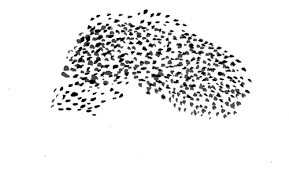

cloud_murmation
===
Terraform module for creating free cloud infrastructure in Oracle Cloud and Google Cloud using Terraform Cloud for state management.
___

## Instructions
https://learn.hashicorp.com/tutorials/terraform/github-actions
### Terraform Cloud
1. Create organization and workspace
2. Create "sensative" variables for OCI secrets:
    - oci_tenancy
    - oci_user
    - oci_subnetid
    - oci_fingerprint -> https://docs.oracle.com/en-us/iaas/Content/API/Concepts/apisigningkey.htm#four
    - oci_api_private_key -> https://docs.oracle.com/en-us/iaas/Content/API/Concepts/apisigningkey.htm#two (use "pbcopy" to maintain file formatting)
    - oci_ssh_public_key -> https://registry.terraform.io/providers/hashicorp/oci/latest/docs/resources/core_instance
3. Create variables:
    - oci_displayname1
    - oci_hostname1
    - oci_displayname2
    - oci_hostname2
4. Create api token
### Github
5. Add api token "TF_API_TOKEN" as a "Repository Secret" to the repo
